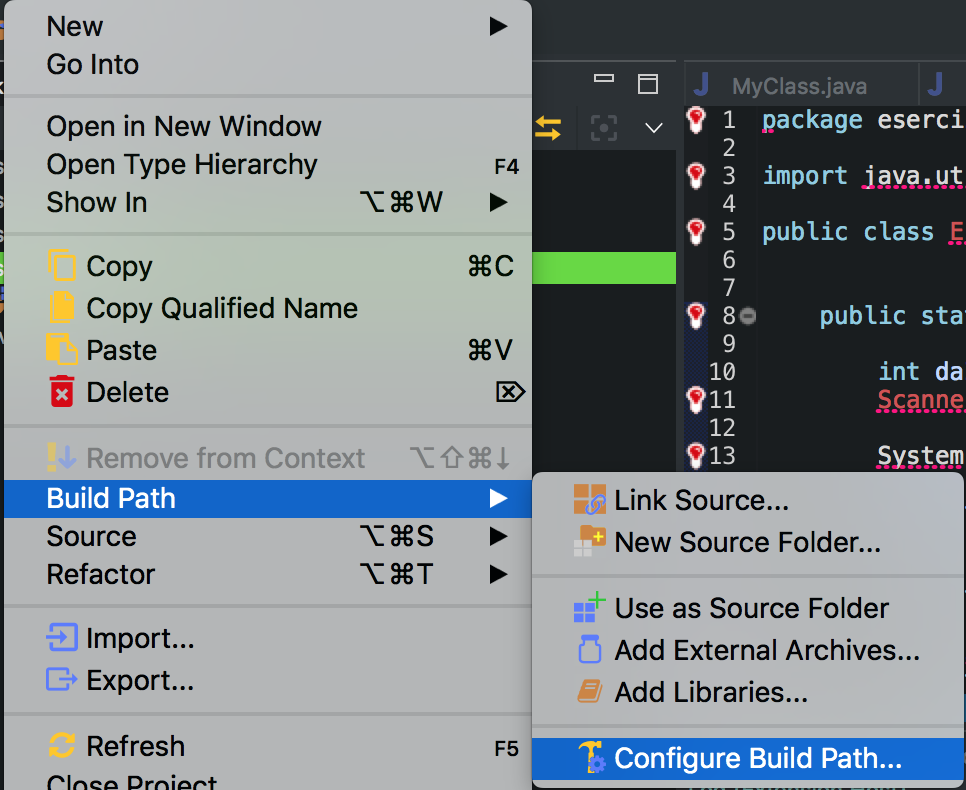
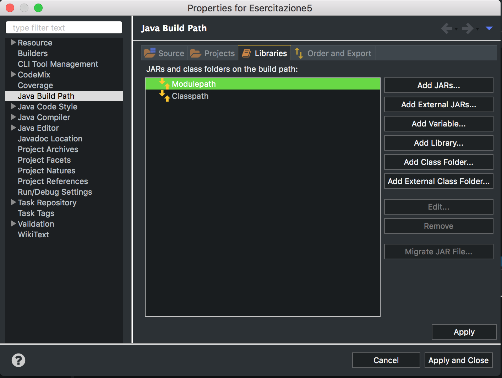
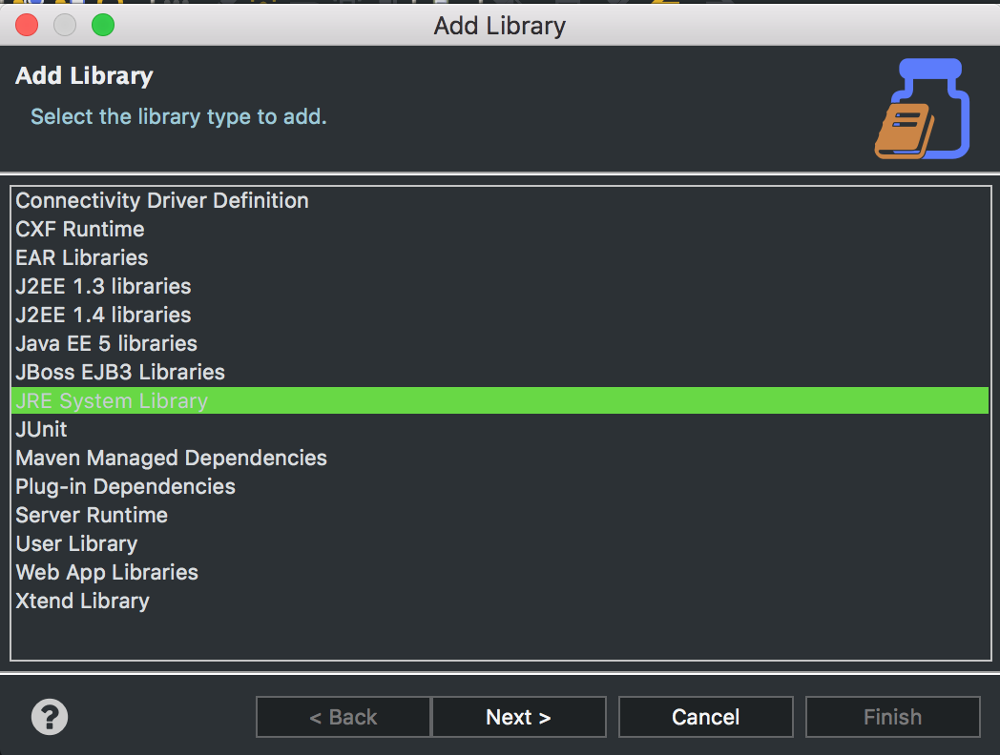
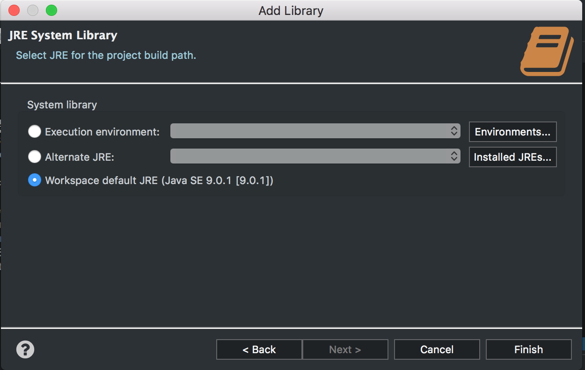

# Gestionale2021
Dubbi frequenti presentati durante le esercitazioni

Questa guida verrà aggiornata dopo ogni esercitazione e fungerà come punto di raccolta dei dubbi più frequenti.

Sito del corso disponibile su Virtuale [qui](https://virtuale.unibo.it/course/view.php?id=20726).

**N.B.** Eventuali dubbi potranno essere segnalati anche via e-mail.

## Installazione del JDK e di Eclipse
Facendo riferimento alle slide presenti sul **Virtuale** i passi da seguire in sequenza sono i seguenti:
1. Installare il JDK
2. Installare Eclipse

**Importante Mac**: le ultime versioni di MacOs prevedono anche l'istallazione jdk. Per vedere se il jdk è installato consultare le slide di laboratorio

## Risoluzione problemi Eclipse
### Mancanza librerie
È possibile che la versione usata del JDK a casa sia diversa da quella del laboratorio. Questo potrebbe provocare (se la versione del JDK di casa è più recente rispetto a quella del laboratorio) un'incongruenza di librerie nel progetto e una conseguente eliminazione delle librerie dal progetto. Quindi il risultato sarà un progetto pieno di errori.


Ci toccherà aggiungere nuovamente la libreria.

Per fare ciò occorre configurare il **build Path** (tasto destro sul progett --> Build Path --> Configure Build Path).



Selezionando la sezione **libraries**, potremo aggiungere la nostra libreria.



Selezioniamo **Modulepath** e successivamente **Add Library**

La scheramata successiva sarà la seguente.



Selezioniamo **JRE System Library** clicchiamo su **Next**.



Lasciamo tutto così com'è e clicchiamo su **Finish**

Al termine di questa operazione clicchiamo su **Apply** e la libreria sarà nuovamente presente.

<!-- ## Input Stringhe
Errore comune quando si vuole leggere una stringa da input risiede nella *nextLine()* della scanner.
Questo è dovuto al comportamento anomalo della *nextLine()* che va a consumare l'invio della lettura precedente.
```java
Scanner tastiera = new Scanner(System.in);

<!-- // NextLine senza alcun comprtamento anomalo
System.out.println("Inserisci una stringa: ");
String s1 = tastiera.nextLine();

<!-- tastiera.close();
```
In questo caso non avremo nessuno comportamento anomalo, in quanto non viene effettuata alcuna lettura prima della nextLine().

```java
Scanner tastiera = new Scanner(System.in);

System.out.println("Inserisci un intero: ");
int in1 = tastiera.nextInt();

//NextLine con comportamento anomalo
System.out.println("Inserisci una stringa: ");
String s1 = tastiera.nextLine();

tastiera.close();
```

<!-- In questo caso, la *nextLine()* andrà a consumare l'**enter** inserito al termine dell'input *tastiera.nextInt()*. Questo significa che dentro s1 ci sarà una stringa vuota.

<!-- Quindi la sequenza di istruzioni **corretta** diventa la seguente

```java
Scanner tastiera = new Scanner(System.in);

System.out.println("Inserisci un intero: ");
int in1 = tastiera.nextInt();

tastiera.nextLine(); //consumo il tasto enter

//NextLine senza comportamento anomalo
System.out.println("Inserisci una stringa: ");
String s1 = tastiera.nextLine();

tastiera.close();
```

<!-- ## Istruzioni di selezione
Uno dei problemi più frequenti sull'istruzione di selezione **if/else** riguarda la struttura. In particolare

```java

if(condizione);{
    //il codice inserito all'interno di questo blocco non verrà mai eseguito
}else
{
    //altre istruzioni
}
```
<!-- L'errore in questo caso risiede nell'inserimento del terminatore '**;**' presente al termine della condizione. Questo terminatore infatti impedirà, nel caso in cui siano soddisfatte le condizioni, l'esecuzione delle istruzioni presenti dentro il blocco dell'if.

<!-- Un altro dubbio riguardante la struttura riguarda il numero di istruzioni inseribili all'interno del blocco.

```java
if (condizione)
    //una sola istruzione
else if(condizione2)
    //una sola istruzione
else
    //una sola istruzione
```
<!-- In questo caso non ho specificato le parentesi graffe, quindi posso inserire una sola istruzione all'interno dell'istruzione **if/else**, tutte le altre istruzioni saranno considerate esterne all'istruzione di selezione.
Quindi nel caso in cui vogliamo eseguire più di una singola istruzione bisognerà **obbligatoriamente** usare le parentesi graffe.

```java
if(condizione){
    /*Tutte le istruzioni inserite in questo blocco verranno 
    eseguite solo se la condizione è soddisfatta*/
}
else if(condizione2){
    /*Tutte le istruzioni inserite in questo blocco verranno 
    eseguite solo se la condizione2 è soddisfatta*/
}else{
    /*Tutte le istruzioni inserite in questo blocco verranno 
    eseguite se le precendenti condizioni non sono soddisfatte*/
}

```

<!-- ### Assegnamento VS Uguaglianza
Uno degli errori più comuni riguarda la distinzione tra questi due operatori '**=**' e '**==**'.
L'operatore '**=**' è usato per assegnare un valore ad una variabile. Quindi ricordando la struttura di una variabile
```java
    tipo nome = valore
```
Questo permetterà di inserire il valore dentro la **cella di memoria** alla quale è stato assegnato il nome *nome*.

<!-- Diverso è il caso di'**==**'. È un operatore di comparazione. Questo significa che potrà essere usato per verificare l'ugualianza di due valori (come illustrato di seguito).

```java
int n1 = 10;
int n2 = 11;

if(n1 == n2){
    //esegui queste istruzioni
}else
    //esegui questa istruzione
```

<!-- In conclusione, non bisogna **MAI** scrivere una cosa del genere
```java
int n1 = 10;
int n2 = 11;

<!-- if(n1 = n2){ //SBAGLIATO
    //esegui queste istruzioni
}else
    //esegui questa istruzione
```
Il compilatore comunque segnalerà questa tipologia di errore, in quanto riconoscerà l'errore nella sintassi.

<!-- # Iterazione
Bisogna fare attenzione ai cicli "*fantasma*". Se scriviamo
```java
for(int i = 0; i < 10; i ++); {
    System.out.println(i);
}
```
Il valore di **i** non verrà mai stampato! Perchè è presente un '**;**' prima della parentesi graffa. 

<!-- Questo errore è molto simile a quello presentato nella prima parte delle istruzioni di selezione.

<!-- # Classi
## Come si crea un'istanza di una classe?
Uno dei dubbi più presenti durante questa esercitazionw riguarda principalmente la creazione dell'istanza.

<!-- Basta pensare semplicemente alla famosissima e usatissima classe **Scanner**, che usiamo tutte le volte che vogliamo prendere un input
```java
    Scanner s = null; // in questo momento esiste una varibile di nome 's' inizializzata a null, ma ancora non esiste un'istanza di Scanner

    s = new Scanner(System.in); // ora 's' è diventata un'istanza della classe Scanner
```

Per poter accedere poi ai metodi della classe Scanner basta usare la **notazione puntata**.

Questo significa che tutti i metodi **pubblici** (preceduti dalla keyword **public**) definiti all'interno della classe Scanner potranno essere usati.

La stessa cosa vale per una classe creata da noi. Supponendo di aver creato una classe **Persona** contenente un metodo **getNome()**, per accedere a tale metodo la sintassi è la seguente
```java
    /*Per prima cosa creo un'istanza della classe persona!*/
    Persona pers = new Persona();

    /*Ora posso accedere a tutti i metodi definiti all'interno della classe persona*/
    String nome = pers.getNome(); //in questo caso il metodo restituirà una stringa
```

<!-- ## È possibile che un metodo restituisca un'istanza di una classe?
**CERTO** ed è fondamentale!

<!-- Questo permette di crearci un tipo di ritorno personalizzato, in quanto la classe è un "tipo" (riferimento) creato da noi.

```java
public Persona getAngelo(){
    Persona p = new Persona();
    p.setNome("Angelo"); //metodo set (di inizializzazione)

    return p;
}
```

